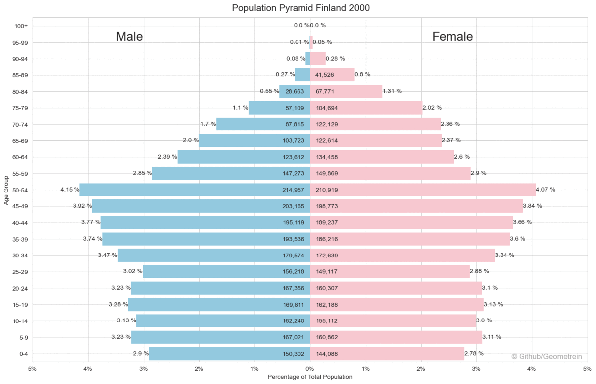

# The Finnish Line

---



## About
This repo contains a collection of jupyter notebooks and data extracts used to generate the following articles:

[](https://medium.com/@geometrein/the-finnish-line-d5110baae543)
[](https://www.linkedin.com/pulse/finnishline-tigran-khachatryan)

## Data Sources

---
The data used in this project is extracted from the following sources:

[](https://pxdata.stat.fi/PxWeb/pxweb/en/StatFin/)


## Installation

---
Launch the notebooks in binder:

[](https://mybinder.org/v2/gh/Geometrein/the-finnish-line/HEAD)

#### Local install
Move  to the finnish line directory :)  
```
cd the_finnish_line
```
Make sure you have conda installed and run:
```bash
conda env create -f environment.yml
```
or if you're using pip simply run:
```bash
python3 -m venv venv
source venv/bin/activate
pip install -r requirements.txt
```


